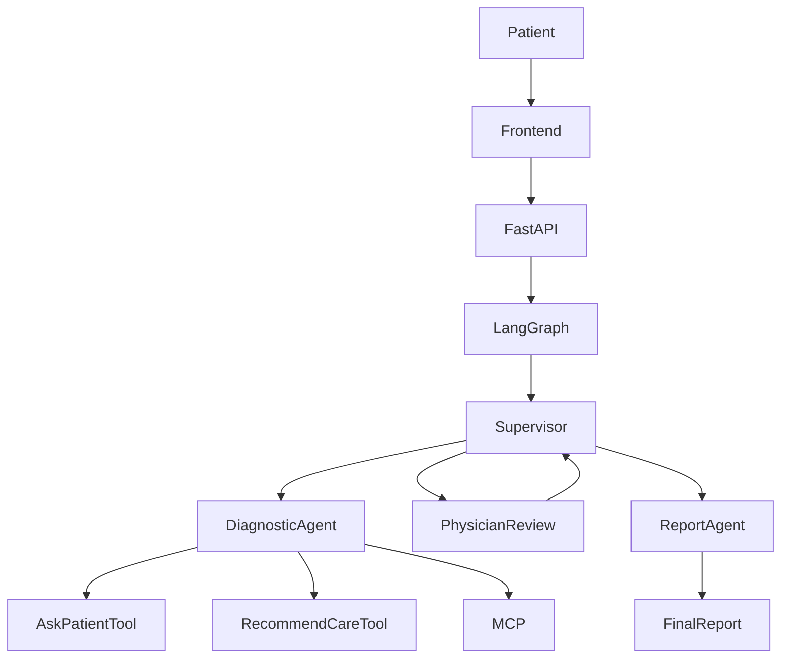

# Architecture

## Components

- `Patient`: user interacting with the academic simulation.
- `Frontend`: React/Vite interface.
- `FastAPI`: backend API for consultation start, resume, state, and report.
- `LangGraph`: graph orchestration layer.
- `Supervisor`: routing node.
- `DiagnosticAgent`: patient interview and preliminary synthesis.
- `MCP`: external medical support tools.
- `PhysicianReview`: Human-in-the-Loop validation.
- `ReportAgent`: final structured report generation.
