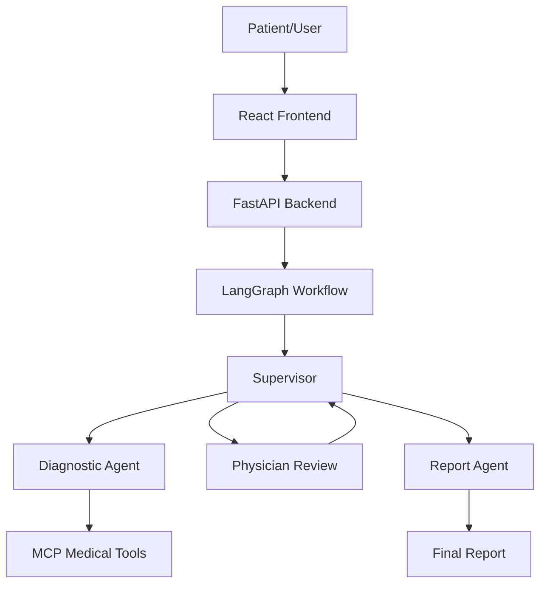
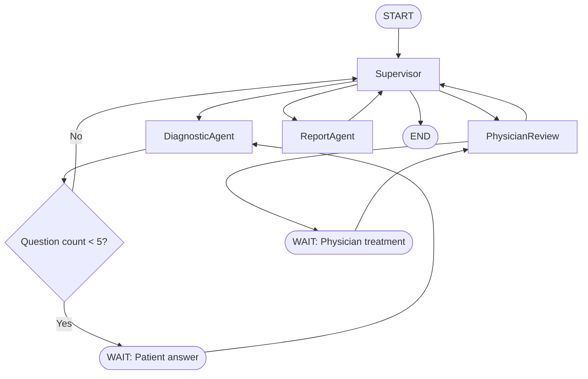
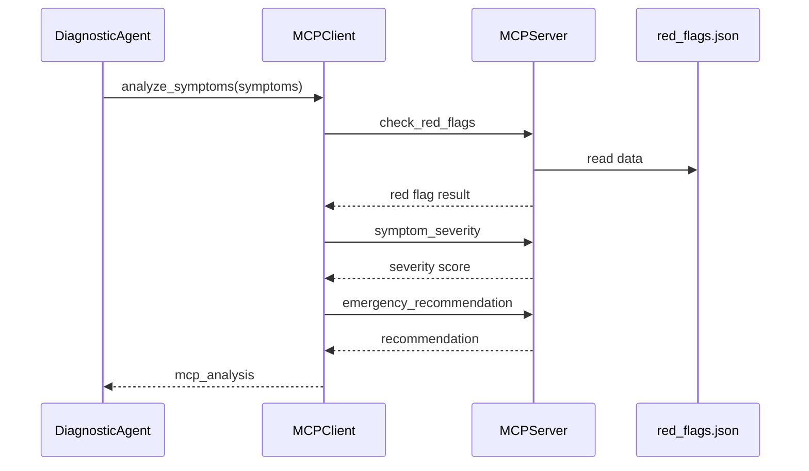

# Technical Report

## 1. Introduction

This project implements an academic medical multi-agent system for preliminary
clinical orientation. It combines LangGraph, LangChain, FastAPI, MCP, React, and
LangGraph Studio to demonstrate how agentic workflows can be structured,
validated, interrupted, resumed, and presented through a web interface.

The system is not a medical device. It does not diagnose, prescribe treatment,
or replace a professional medical consultation. Its purpose is to demonstrate
software architecture, multi-agent orchestration, tool integration, and
Human-in-the-Loop validation in a controlled academic setting.

The core scenario is a simulated consultation. A user enters an initial patient
case, answers five patient questions, reviews an intermediate clinical
orientation, submits a physician treatment decision, and receives a final
structured report.

## 2. Project Objectives

The main objective is to build a complete multi-agent clinical-orientation
workflow with explicit state transitions and demonstrable validation points.

Specific objectives:

- Model the clinical-orientation workflow as a graph.
- Separate responsibilities between supervisor, diagnostic, review, and report
  agents.
- Implement a five-question patient interview loop.
- Integrate external medical support tools through MCP.
- Add a Human-in-the-Loop physician validation interruption.
- Expose the workflow through a FastAPI backend.
- Provide a React frontend for classroom demonstration.
- Validate the workflow in LangGraph Studio.
- Package the project with documentation, diagrams, scenarios, and Docker
  support.

## 3. Functional Requirements

The system supports the following functional requirements:

- Start a new consultation from an initial patient case.
- Ask exactly five patient questions.
- Store patient answers in shared workflow state.
- Extract symptoms from the case and answers.
- Query MCP tools for red flags, severity, and recommendations.
- Produce a preliminary clinical synthesis.
- Pause for physician review.
- Resume after physician treatment is submitted.
- Generate a final structured report.
- Display the academic disclaimer.
- Expose API endpoints for start, resume, state inspection, and report retrieval.
- Provide frontend pages for start, questions, physician review, and final report.
- Support LangGraph Studio inspection of graph topology and state.

## 4. Multi-Agent Architecture

The architecture is organized around specialized nodes:

- `Supervisor`: decides the next graph node.
- `DiagnosticAgent`: manages the patient interview and preliminary synthesis.
- `PhysicianReview`: creates the Human-in-the-Loop review request and waits for
  physician input.
- `ReportAgent`: generates the final report.



This separation keeps orchestration, interview logic, human validation, and
report generation understandable and testable.

## 5. Shared State Design

The workflow uses a shared `MedicalState` TypedDict. It stores the values needed
by all graph nodes and by the API layer.

Important fields:

- `patient_case`
- `patient_answers`
- `question_count`
- `current_question`
- `waiting_for_patient`
- `diagnostic_summary`
- `interim_care`
- `mcp_analysis`
- `waiting_for_physician`
- `physician_review_request`
- `physician_treatment`
- `final_report`

The state design makes interruptions explicit. When `waiting_for_patient=True`,
the graph pauses after a question. When `waiting_for_physician=True`, the graph
pauses before final report generation.

## 6. LangGraph Workflow

The workflow is implemented as a `StateGraph`. It begins at `START`, routes to
the supervisor, and then moves through diagnostic, review, and report nodes.



The graph is exported as `graph` from `backend/app/graph.py`, allowing
LangGraph Studio to load it from `backend/langgraph.json`.

Thread support is provided through a `thread_id` configuration:

```python
{
    "configurable": {
        "thread_id": thread_id
    }
}
```

## 7. MCP Integration

The MCP server exposes local medical support tools backed by
`mcp_server/data/red_flags.json`.

MCP tools:

- `check_red_flags`
- `symptom_severity`
- `emergency_recommendation`

The backend MCP client calls these tools after the five patient answers are
collected. The response is stored in `mcp_analysis` and included in the
preliminary synthesis.



## 8. Human-in-the-Loop Design

The Human-in-the-Loop step is implemented in the `PhysicianReview` node. After
the diagnostic summary is generated, the supervisor routes the state to the
physician review node.

If no physician treatment is present, the node creates a readable review request
and sets:

```python
waiting_for_physician = True
```

The graph then pauses. The workflow resumes only after the API receives
`physician_treatment`.

This design demonstrates a realistic control point for academic discussion:
automation provides a preliminary synthesis, but a human validates the next
step before the final report is generated.

## 9. FastAPI Layer

FastAPI exposes the graph as a web API. It manages session creation, graph
invocation, state serialization, and response shaping.

Endpoints:

- `POST /consultation/start`
- `POST /consultation/resume`
- `GET /consultation/{thread_id}`
- `GET /consultation/{thread_id}/report`

The API returns status values such as:

- `waiting_patient`
- `waiting_physician`
- `completed`
- `not_ready`

These values are used by the frontend to route the user through the workflow.

## 10. Frontend Layer

The frontend is implemented with React and Vite. It provides four main pages:

- Start consultation
- Patient questions
- Physician review
- Final report

The frontend uses an Axios API client and a consultation context to store:

- current thread ID
- status
- current question
- answers
- review request
- final report
- loading and error state

The interface uses French academic wording such as:

- `orientation clinique préliminaire`
- `synthèse clinique préliminaire`
- `recommandation intermédiaire`

It also displays:

`Ce système ne remplace pas une consultation médicale.`

## 11. LangGraph Studio Validation

LangGraph Studio is used to visualize and validate the workflow.

Validation includes:

- Graph topology inspection
- State inspection
- Patient interruption validation
- Physician interruption validation
- Resume behavior validation
- Final report generation validation

The graph is configured in `backend/langgraph.json`:

```json
{
  "dependencies": ["./"],
  "graphs": {
    "medical_graph": "./app/graph.py:graph"
  },
  "env": "./.env"
}
```

## 12. Test Scenarios

Three validation scenarios are provided.

Scenario 1:

- Patient with light cough, fatigue, and moderate fever.
- Expected: five questions, physician review, final report.

Scenario 2:

- Patient with chest pain and difficulty breathing.
- Expected: MCP red flags detected, high severity, physician review, final report.

Scenario 3:

- Patient with mild fatigue and headache.
- Expected: low severity and final report.

Run:

```bash
cd backend
source .venv/bin/activate
python tests/run_all_scenarios.py
```

## 13. Challenges Encountered

Key challenges included:

- Designing explicit graph pauses for both patient answers and physician review.
- Keeping shared state consistent across repeated graph invocations.
- Integrating MCP tool results into a deterministic academic workflow.
- Making the frontend route correctly based on backend status.
- Supporting LangGraph Studio while also allowing local checkpointer behavior.
- Preserving medical safety wording throughout the user interface and report.

## 14. Future Improvements

Possible improvements:

- Replace rule-based question generation with a controlled LLM prompt.
- Add authentication for physician review.
- Persist sessions in a database.
- Add automated API tests with pytest.
- Add frontend end-to-end tests.
- Improve Docker production serving for the frontend.
- Add richer MCP medical datasets.
- Add multilingual report export.

## 15. Conclusion

The project demonstrates a complete academic multi-agent medical orientation
system. It combines graph orchestration, external tool integration, human
validation, API delivery, frontend interaction, and Studio validation.

The final system is ready for classroom demonstration, oral defense, GitHub
submission, and ZIP submission.

**This system does not replace a medical consultation.**
