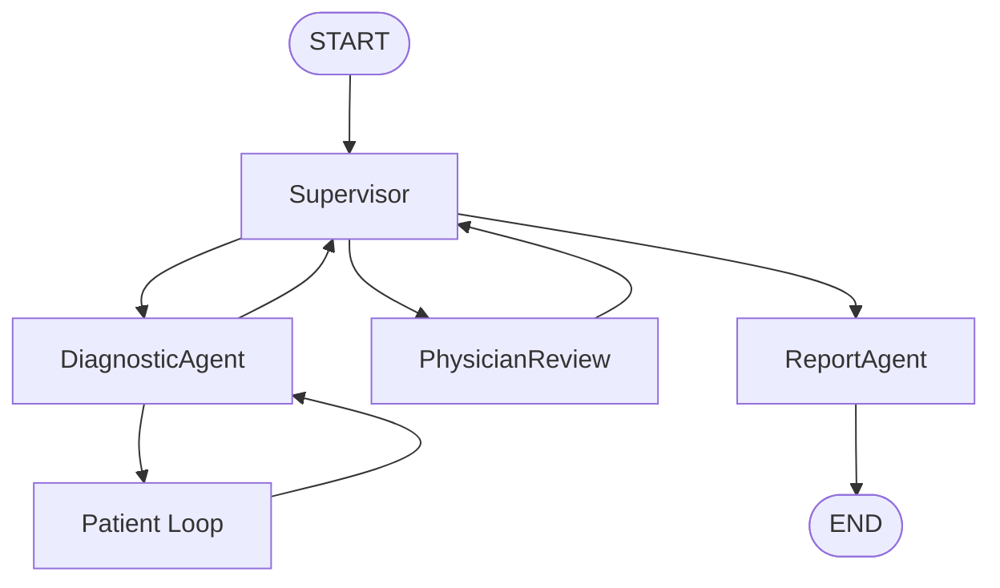

# LangGraph Workflow

## Workflow Summary

1. `START`
2. `Supervisor`
3. `DiagnosticAgent`
4. `Patient Loop`
5. `Supervisor`
6. `PhysicianReview`
7. `Supervisor`
8. `ReportAgent`
9. `END`

## Interruption Points

- Patient interruption: `waiting_for_patient=True`
- Physician interruption: `waiting_for_physician=True`
